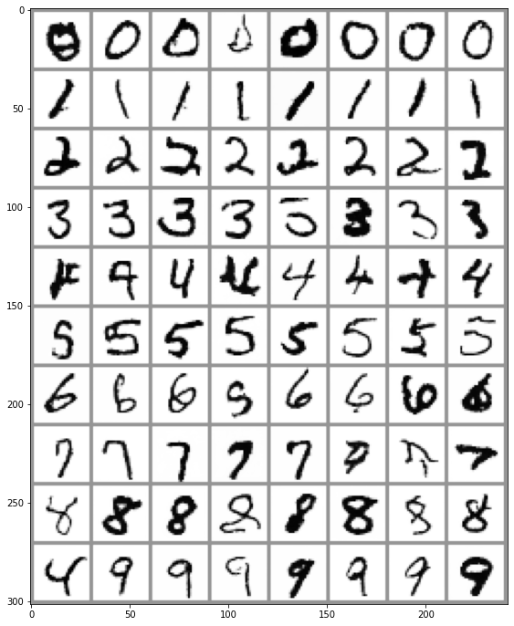

# Unit 2: Fine-Tuning, Guidance and Conditioning

Welcome to Unit 2 of the Hugging Face Diffusion Models Course! In this unit you will learn how to use and adapt pre-trained diffusion models in new ways. You will also see how we can create diffusion models that take additional inputs as **conditioning** to control the generation process.

## Start this Unit :rocket:

Here are the steps for this unit:

- Make sure you've [signed up for this course](https://huggingface.us17.list-manage.com/subscribe?u=7f57e683fa28b51bfc493d048&id=ef963b4162) so that you can be notified when new material is released
- Read through the material below for an overview of the key ideas of this unit
- Check out the _**Fine-tuning and Guidance**_ notebook to fine-tune an existing diffusion model on a new dataset using the 🤗 Diffusers library and to modify the sampling procedure using guidance
- Follow the example in the notebook to share a Gradio demo for your custom model
- (Optional) Check out the _**Class-conditioned Diffusion Model Example**_ notebook to see how we can add additional control to the generation process.

:loudspeaker: Don't forget to join the [Discord](https://huggingface.co/join/discord), where you can discuss the material and share what you've made in the `#diffusion-models-class` channel.
 
## Fine-Tuning

As you may have seen in Unit 1, training diffusion models from scratch can be time-consuming! Especially as we push to higher resolutions, the time and data required to train a model from scratch can become impractical. Fortunately, there is a solution: begin with a model that has already been trained! This way we start from a model that has already learnt to denoise images of some kind, and the hope is that this provides a better starting point than beginning from a randomly initialized model.

Fine-tuning typically works best if the new data somewhat resembles the base model's original training data (for example, beginning with a model trained on faces is probably a good idea if you're trying to generate cartoon faces) but suprisinggly the benefits persist even if the domain is changed quite drastically. The image above is generated from a [model trained on the LSUN Bedrooms dataset](https://huggingface.co/google/ddpm-bedroom-256) and fine-tuned for 500 steps on [the WikiArt dataset](https://huggingface.co/datasets/huggan/wikiart). The [training script](https://github.com/huggingface/diffusion-models-class/blob/main/unit2/finetune_model.py) is included for reference alongside the notebooks for this unit.

## Guidance

Unconditional models don't give much control over what is generated. We can train a conditional model (more on that in the next section) that takes additional inputs to help steer the generation process, but what if we already have a trained unconditional model we'd like to use? Enter guidance, a process by which the model predictions at each step in the generation process are evaluated against some guidance function and modified such that the final generated image is more to our liking. 

This guidance function can be almost anything, making this a powerful technique! In the notebook we build up from a simple example (controlling the color, as illustrated in the example output above) to one utilizing a powerful pre-trained model called CLIP which lets us guide generation based on a text description. 

## Conditioning

Guidance is a great way to get some additional mileage from an unconditional diffusion model, but if we have additional information (such as a class label or an image caption) available during training then we can also feed this to the model for it to use as it makes its predictions. In doing so, we create a **conditional** model, which we can control at inference time by controlling what is fed in as conditioning. The notebook shows an example of a class-conditioned model which learns to generate images according to a class label. 

There are a number of ways to pass in this conditioning information, such as
- Feeding it in as additional channels in the input to the UNet. This is often used when the conditioning information is the same shape as the image, such as a segmentation mask, a depth map or a blurry version of the image (in the case of a restoration/superresolution model). It does work for other types of conditioning too. For example, in the notebook the class label is mapped to an embedding and then expanded to be the same width and height as the input image so that it can be fed in as additional channels.
- Creating an embedding and then projecting it down to a size that matches the number of channels at the output of one or more internal layers of the unet, and then adding it to those outputs. This is how the timestep conditioning is handled, for example. The output of each resnet block has a projected timestep embedding added to it. This is useful when you have a vector such as a CLIP image embedding as your conditioning information. A notable example is the ['Image Variations' version of Stable Diffusion](https://huggingface.co/spaces/lambdalabs/stable-diffusion-image-variations) which does exactly this.
- Adding cross-attention layers that can 'attend' to a sequence passed in as conditioning. This is most useful when the conditioning is in the form of some text - the text is mapped to a sequence of embeddings using a transformer model, and then cross-attention layers in the unet are used to incorporate this information into the denoising path. We'll see this in action in Unit 3 as we examine how Stable Diffusion handles text conditioning.

## Hands-On Notebook

| Chapter                                     | Colab                                                                                                                                                                                               | Kaggle                                                                                                                                                                                                   | Gradient                                                                                                                                                                               | Studio Lab                                                                                                                                                                                                   |
|:--------------------------------------------|:----------------------------------------------------------------------------------------------------------------------------------------------------------------------------------------------------|:---------------------------------------------------------------------------------------------------------------------------------------------------------------------------------------------------------|:---------------------------------------------------------------------------------------------------------------------------------------------------------------------------------------|:-------------------------------------------------------------------------------------------------------------------------------------------------------------------------------------------------------------|
| Fine-tuning and Guidance                                |               |               |               |               |
| Class-conditioned Diffusion Model Example                               |               |               |               |               |

At this point, you know enough to get started with the accompanying notebooks! Open them in your platform of choice using the links above. Fine-tuning is quite computationally intensive, so if you're using Kaggle or Google Colab make sure you set the runtime type to 'GPU' for best results.

The bulk of the material is in _**Fine-tuning and Guidance**_, where we explore these two topics through worked examples. The notebook shows how you can fine-tune an existing model on new data, add guidance, and share the result as a Gradio demo. There is an accompanying script ([finetune_model.py](https://github.com/huggingface/diffusion-models-class/blob/main/unit2/finetune_model.py)) that makes it easy to experiment with different fine-tuning settings, and [an example space](https://huggingface.co/spaces/johnowhitaker/color-guided-wikiart-diffusion) which you can use as a template for sharing your own demo on 🤗 Spaces. 

In _**Class-conditioned Diffusion Model Example**_ we show a brief worked example of creating a diffusion model conditioned on class labels using the MNIST dataset. The focus is on demonstrating the core idea as simply as possible: by giving the model extra information about what it is supposed to be denoising, we can later control what kinds of images are generated at inference time.

## Project Time

Following the examples in the _**Fine-tuning and Guidance**_ notebook, fine-tune your own model or pick an existing model and create a Gradio demo to showcase your new guidance skills. Don't forget to share your demo on Discord, Twitter etc so we can admire your work!

## Some Additional Resources

[Denoising Diffusion Implicit Models](https://arxiv.org/abs/2010.02502) - Introduced the DDIM sampling method (used by DDIMScheduler)
 
[GLIDE: Towards Photorealistic Image Generation and Editing with Text-Guided Diffusion Models](https://arxiv.org/abs/2112.10741) - Introduced mothods for conditioning diffusion models on text

[eDiffi: Text-to-Image Diffusion Models with an Ensemble of Expert Denoisers](https://arxiv.org/abs/2211.01324) - Shows how many different kinds of conditioning can be used together to give even more control over the kinds of samples generated

Found more great resources? Let us know and we'll add them to this list.
