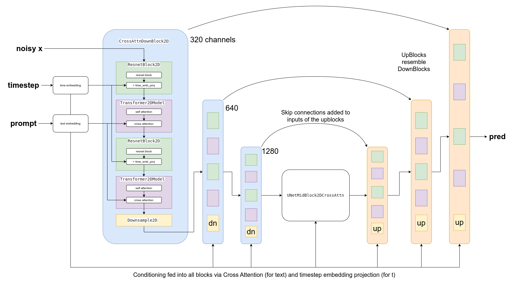

# Unit 3: Stable Diffusion

Welcome to Unit 3 of the Hugging Face Diffusion Models Course! In this unit you will meet a powerful diffusion model called Stable Diffusion (SD) and explore what it can do.

## Start this Unit :rocket:

Here are the steps for this unit:

- Make sure you've [signed up for this course](https://huggingface.us17.list-manage.com/subscribe?u=7f57e683fa28b51bfc493d048&id=ef963b4162) so that you can be notified when new material is released
- Read through the material below for an overview of the key ideas of this unit
- Check out the [_**Stable Diffusion Introduction**_ notebook](#hands-on-notebook) to see SD applied in practice to some common use-cases
- Use the _**Dreambooth**_ notebook in the [**hackathon** folder](https://github.com/huggingface/diffusion-models-class/tree/main/hackathon) to fine-tune your own custom Stable Diffusion model and share it with the community for a chance to win some prizes and swag
- (Optional) Check out the [_**Stable Diffusion Deep Dive video**_](https://www.youtube.com/watch?app=desktop&v=0_BBRNYInx8) and the accompanying [_**notebook**_](https://github.com/fastai/diffusion-nbs/blob/master/Stable%20Diffusion%20Deep%20Dive.ipynb) for a deeper exploration of the different components and how they can be adapted for different effects. This material was created for the new FastAI course, ['Stable Diffusion from the Foundations'](https://www.fast.ai/posts/part2-2022.html) - the first few lessons are already available and the rest will be released in the next few months, making this a great supplement to this class for anyone curious about building these kinds of models completely from scratch. 

:loudspeaker: Don't forget to join the [Discord](https://huggingface.co/join/discord), where you can discuss the material and share what you've made in the `#diffusion-models-class` channel.

## Introduction

 
_Example images generated using Stable Diffusion_

Stable Diffusion is a powerful text-conditioned latent diffusion model. Don't worry, we'll explain those words shortly! Its ability to create amazing images from text descriptions has made it an internet sensation. In this unit, we're going to explore how SD works and see what other tricks it can do.
 
## Latent Diffusion

As image size grows, so does the computational power required to work with those images. This is especially pronounced in an operation called self-attention, where the amount of operations grows quadratically with the number of inputs. A 128px square image has 4x as many pixels as a 64px square image, and so requires 16x (i.e. 42) the memory and compute in a self-attention layer. This is a problem for anyone who'd like to generate high-resolution images!

 
_Diagram from the [Latent Diffusion paper](http://arxiv.org/abs/2112.10752)_

Latent diffusion helps to mitigate this issue by using a separate model called a Variational Auto-Encoder (VAE) to **compress** images to a smaller spatial dimension. The rationale behind this is that images tend to contain a large amount of redundant information - given enough training data, a VAE can hopefully learn to produce a much smaller representation of an input image and then reconstruct the image based on this small **latent** representation with a high degree of fidelity. The VAE used in SD takes in 3-channel images and produces a 4-channel latent representation with a reduction factor of 8 for each spatial dimension. That is, a 512px square input image will be compressed down to a 4x64x64 latent.

By applying the diffusion process on these **latent representations** rather than on full-resolution images, we can get many of the benefits that would come from using smaller images (lower memory usage, fewer layers needed in the UNet, faster generation times...) and still decode the result back to a high-resolution image once we're ready to view the final result. This innovation dramatically lowers the cost to train and run these models. 

## Text Conditioning

In Unit 2 we showed how feeding additional information to the UNet allows us to have some additional control over the types of images generated. We call this conditioning. Given a noisy version of an image, the model is tasked with predicting the denoised version **based on additional clues** such as a class label or, in the case of Stable Diffusion, a text description of the image. At inference time, we can feed in the description of an image we'd like to see and some pure noise as a starting point, and the model does its best to 'denoise' the random input into something that matches the caption. 

 
_Diagram showing the text encoding process which transforms the input prompt into a set of text embeddings (the encoder_hidden_states) which can then be fed in as conditioning to the UNet._

For this to work, we need to create a numeric representation of the text that captures relevant information about what it describes. To do this, SD leverages a pre-trained transformer model based on something called CLIP. CLIP's text encoder was designed to process image captions into a form that could be used to compare images and text, so it is well suited to the task of creating useful representations from image descriptions. An input prompt is first tokenized (based on a large vocabulary where each word or sub-word is assigned a specific token) and then fed through the CLIP text encoder, producing a 768-dimensional (in the case of SD 1.X) or 1024-dimensional (SD 2.X) vector for each token. To keep things consistent prompts are always padded/truncated to be 77 tokens long, and so the final representation which we use as conditioning is a tensor of shape 77x1024 per prompt.

OK, so how do we actually feed this conditioning information into the UNet for it to use as it makes predictions? The answer is something called cross-attention. Scattered throughout the UNet are cross-attention layers. Each spatial location in the UNet can 'attend' to different tokens in the text conditioning, bringing in relevant information from the prompt. The diagram above shows how this text conditioning (as well as timestep-based conditioning) is fed in at different points. As you can see, at every level the UNet has ample opportunity to make use of this conditioning!

## Classifier-free Guidance

It turns out that even with all of the effort put into making the text conditioning as useful as possible, the model still tends to default to relying mostly on the noisy input image rather than the prompt when making its predictions. In a way, this makes sense - many captions are only loosely related to their associated images and so the model learns not to rely too heavily on the descriptions! However, this is undesirable when it comes time to generate new images - if the model doesn't follow the prompt then we may get images out that don't relate to our description at all.

 
_Images generated from the prompt "An oil painting of a collie in a top hat" with CFG scale 0, 1, 2 and 10 (left to right)_

To fix this, we use a trick called Classifier-Free Guidance (CGF). During training, text conditioning is sometimes kept blank, forcing the model to learn to denoise images with no text information whatsoever (unconditional generation). Then at inference time, we make two separate predictions: one with the text prompt as conditioning and one without. We can then use the difference between these two predictions to create a final combined prediction that pushes **even further** in the direction indicated by the text-conditioned prediction according to some scaling factor (the guidance scale), hopefully resulting in an image that better matches the prompt. The image above shows the outputs for a prompt at different guidance scales - as you can see, higher values result in images that better match the description.

## Other Types of Conditioning: Super-Resolution, Inpainting and Depth-to-Image

It is possible to create versions of Stable Diffusion that take in additional kinds of conditioning. For example, the [Depth-to-Image model](https://huggingface.co/stabilityai/stable-diffusion-2-depth) has extra input channels that take in-depth information about the image being denoised, and at inference time we can feed in the depth map of a target image (estimated using a separate model) to hopefully generate an image with a similar overall structure. 

 
_Depth-conditioned SD is able to generate different images with the same overall structure (example from StabilityAI)_

In a similar manner, we can feed in a low-resolution image as the conditioning and have the model generate the high-resolution version ([as used by the Stable Diffusion Upscaler](https://huggingface.co/stabilityai/stable-diffusion-x4-upscaler)). Finally, we can feed in a mask showing a region of the image to be re-generated as part of the 'in-painting' task, where the non-mask regions need to stay intact while new content is generated for the masked area. 

## Fine-Tuning with DreamBooth

_Image from the [dreambooth project page](https://dreambooth.github.io/) based on the Imagen model_

DreamBooth is a technique for fine-tuning a text-to-image model to 'teach' it a new concept, such as a specific object or style. The technique was originally developed for Google's Imagen model but was quickly adapted to [work for stable diffusion](https://huggingface.co/docs/diffusers/training/dreambooth). Results can be extremely impressive (if you've seen anyone with an AI profile picture on social media recently the odds are high it came from a dreambooth-based service) but the technique is also sensitive to the settings used, so check out our notebook and [this great investigation into the different training parameters](https://huggingface.co/blog/dreambooth) for some tips on getting it working as well as possible.

## Hands-On Notebook

| Chapter                                     | Colab                                                                                                                                                                                               | Kaggle                                                                                                                                                                                                   | Gradient                                                                                                                                                                               | Studio Lab                                                                                                                                                                                                   |
|:--------------------------------------------|:----------------------------------------------------------------------------------------------------------------------------------------------------------------------------------------------------|:---------------------------------------------------------------------------------------------------------------------------------------------------------------------------------------------------------|:---------------------------------------------------------------------------------------------------------------------------------------------------------------------------------------|:-------------------------------------------------------------------------------------------------------------------------------------------------------------------------------------------------------------|
| Stable Diffusion Introduction                                |               |               |               |               |
| DreamBooth Hackathon Notebook                      |               |               |               |               |
| Stable Diffusion Deep Dive                               |               |               |               |               |

At this point, you know enough to get started with the accompanying notebooks! Open them in your platform of choice using the links above. Dreambooth requires quite a lot of compute power, so if you're using Kaggle or Google Colab make sure you set the runtime type to 'GPU' for the best results. 

The 'Stable Diffusion Introduction' notebook is a short introduction to stable diffusion with the 🤗 Diffusers library, stepping through some basic usage examples using pipelines to generate and modify images.

In the DreamBooth Hackathon Notebook (in the [hackathon folder](https://github.com/huggingface/diffusion-models-class/tree/main/hackathon)) we show how you can fine-tune SD on your own images to create a custom version of the model covering a new style or concept.

Finally, the 'Stable Diffusion Deep Dive' notebook and video break down every step in a typical generation pipeline, suggesting some novel ways to modify each stage for additional creative control. 

## Project Time

Follow the instructions in the **DreamBooth** notebook to train your own model for one of the specified categories. Make sure you include the example outputs in your submission so that we can choose the best models in each category! See the [hackathon info](https://github.com/huggingface/diffusion-models-class/tree/main/hackathon) for details on prizes, GPU credits and more.

## Some Additional Resources

- [High-Resolution Image Synthesis with Latent Diffusion Models](http://arxiv.org/abs/2112.10752) - The paper that introduced the approach behind Stable Diffusion

- [CLIP](https://openai.com/blog/clip/) - CLIP learns to connect text with images and the CLIP text encoder is used to transform a text prompt into the rich numerical representation used by SD. See also, [this article on OpenCLIP](https://wandb.ai/johnowhitaker/openclip-benchmarking/reports/Exploring-OpenCLIP--VmlldzoyOTIzNzIz) for some background on recent open-source CLIP variants (one of which is used for SD version 2).

- [GLIDE: Towards Photorealistic Image Generation and Editing with Text-Guided Diffusion Models](https://arxiv.org/abs/2112.10741) an early paper demonstrating text conditioning and CFG

Found more great resources? Let us know and we'll add them to this list.
