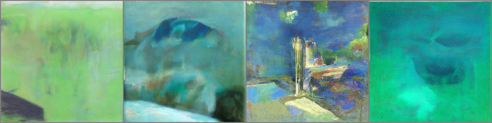

# Vue d'ensemble

<CourseFloatingBanner
    unit={2}
    classNames="absolute z-10 right-0 top-0"
/>

Dans cette unité, vous apprendrez à utiliser et à adapter les modèles de diffusion pré-entraînés de nouvelles façons. Vous verrez également comment nous pouvons créer des modèles de diffusion qui prennent des entrées supplémentaires comme **conditionnement** pour contrôler le processus de génération.

## Vue d'ensemble de cette unité :rocket:

Les différentes étapes à suivre pour cette unité :

- Lisez le matériel ci-dessous pour avoir une vue d'ensemble des idées clés de cette unité
- Consultez le *notebook _**Finetuning et guidage**_ pour finetuner un modèle de diffusion existant sur un nouveau jeu de données en utilisant la bibliothèque 🤗 *Diffusers* et pour modifier la procédure d'échantillonnage en utilisant le guidage.
- Suivez l'exemple dans le *notebook* pour partager une démo Gradio pour votre modèle personnalisé
- (Facultatif) Consultez le *notebook _**Modèle de diffusion conditionné par la classe**_ pour voir comment nous pouvons ajouter un contrôle supplémentaire au processus de génération
- (Facultatif) Regardez [cette vidéo](https://www.youtube.com/watch?v=mY20iKOQ2zw) (en anglais) pour une présentation informelle du matériel de cette unité
 
## *Finetuning*

Comme vous avez pu le constater dans l'unité 1, entraîner des modèles de diffusion à partir de zéro peut prendre beaucoup de temps ! Le temps et les données nécessaires pour entraîner un modèle à partir de zéro peuvent devenir irréalisables, en particulier lorsque l'on passe à des résolutions plus élevées. Heureusement, il existe une solution : commencer par un modèle qui a déjà été entraîné ! Ainsi, nous partons d'un modèle qui a déjà appris à débruiter des images, et nous espérons que cela constituera un meilleur point de départ qu'un modèle initialisé de manière aléatoire.

Le *finetuning* fonctionne généralement mieux si les nouvelles données ressemblent quelque peu aux données d'entraînement originales du modèle de base (par exemple, commencer avec un modèle entraîné sur les visages est probablement une bonne idée si vous essayez de générer des visages de dessins animés), mais il est surprenant de constater que les avantages persistent même si le domaine est modifié de manière assez radicale. L'image ci-dessus est générée à partir d'un [modèle entraîné sur le jeu de données LSUN Bedrooms](https://huggingface.co/google/ddpm-bedroom-256) et *finetuné* sur 500 étapes sur [le jeu de données WikiArt](https://huggingface.co/datasets/huggan/wikiart). Le [script d'entraînement](https://github.com/huggingface/diffusion-models-class/blob/main/unit2/finetune_model.py) est inclus à titre de référence dans les *notebooks* de cette unité.

## Guidage
Les modèles inconditionnels ne donnent pas beaucoup de contrôle sur ce qui est généré. Nous pouvons entraîner un modèle conditionnel (plus d'informations à ce sujet dans la section suivante) qui prend des entrées supplémentaires pour aider à diriger le processus de génération, mais que faire si nous avons déjà entraîné un modèle inconditionnel que nous aimerions utiliser ? C'est là qu'intervient le guidage, un processus par lequel les prédictions du modèle à chaque étape du processus de génération sont évaluées par rapport à une fonction de guidage et modifiées de manière à ce que l'image finale générée corresponde mieux à nos attentes. 

Cette fonction de guidage peut être presque n'importe quoi, ce qui en fait une technique puissante ! Dans le *notebook*, nous partons d'un exemple simple (contrôler la couleur, comme illustré dans l'exemple de sortie ci-dessus) pour arriver à un exemple utilisant un puissant modèle pré-entraîné appelé CLIP qui nous permet de guider la génération sur la base d'une description textuelle. 

## Conditionnement

Le guidage est un excellent moyen d'exploiter davantage un modèle de diffusion inconditionnel, mais si nous disposons d'informations supplémentaires (telles qu'une étiquette de classe ou une légende d'image) pendant l'entraînement, nous pouvons également les transmettre au modèle afin qu'il les utilise pour établir ses prédictions. Ce faisant, nous créons un modèle **conditionnel**, que nous pouvons contrôler au moment de l'inférence en contrôlant ce qui est fourni comme conditionnement. Le *notebook* montre un exemple de modèle conditionné par une classe qui apprend à générer des images en fonction d'une étiquette de classe. 

Il existe un certain nombre de façons de transmettre ces informations de conditionnement, par exemple
- En les introduisant sous forme de canaux supplémentaires dans l'entrée du UNet. Cette méthode est souvent utilisée lorsque l'information de conditionnement a la même forme que l'image, comme un masque de segmentation, une carte de profondeur ou une version floue de l'image (dans le cas d'un modèle de restauration/superrésolution). Cela fonctionne aussi pour d'autres types de conditionnement. Par exemple, dans le *notebook*, l'étiquette de la classe est associée en avec un enchâssement puis étendue pour avoir la même largeur et la même hauteur que l'image d'entrée, de sorte qu'elle puisse être introduite sous forme de canaux supplémentaires.
- La création d'un enchâssement et sa projection à une taille correspondant au nombre de canaux à la sortie d'une ou de plusieurs couches internes du UNet, puis son ajout à ces sorties. C'est ainsi que le conditionnement du pas de temps est géré, par exemple. La sortie de chaque bloc Resnet est complétée par une projection de l'enchâssement du pas de temps. Ceci est utile lorsque vous avez un vecteur tel qu'une l'enchâssement CLIP comme information de conditionnement. Un exemple notable est ['Image Variations' version of Stable Diffusion](https://huggingface.co/spaces/lambdalabs/stable-diffusion-image-variations) qui fait exactement cela.
- L'ajout de couches d'attention croisée qui peuvent s'occuper d'une séquence transmise en tant que conditionnement. Ceci est particulièrement utile lorsque le conditionnement se présente sous la forme d'un texte. Le texte est mis en correspondance avec une séquence d'enchâssements à l'aide d'un *transformer* puis les couches d'attention croisée du UNet sont utilisées pour incorporer cette information dans le chemin de débruitage. Nous verrons cela en action dans l'unité 3 lorsque nous examinerons comment Stable Diffusion gère le conditionnement du texte.

## Notebooks

| Chapitre                                    | Colab                                                                                                                                                                                               | Kaggle                                                                                                                                                                                                   | Gradient                                                                                                                                                                               | Studio Lab                                                                                                                                                                                                   |
|:--------------------------------------------|:----------------------------------------------------------------------------------------------------------------------------------------------------------------------------------------------------|:---------------------------------------------------------------------------------------------------------------------------------------------------------------------------------------------------------|:---------------------------------------------------------------------------------------------------------------------------------------------------------------------------------------|:-------------------------------------------------------------------------------------------------------------------------------------------------------------------------------------------------------------|
| Finetuning et guidage                       |               |               |               |               |
| Modèle de diffusion conditionné par la classe  |               |               |               |               |

La plus grande partie du matériel se trouve dans _**Finetuning et guidage**_, où nous explorons ces deux sujets à travers des exemples travaillés. Le *notebook* montre comment vous pouvez *finetuner* un modèle existant sur de nouvelles données, ajouter des conseils, et partager le résultat sous forme de démo Gradio. Il y a un script d'accompagnement ([finetune_model.py](https://github.com/huggingface/diffusion-models-class/blob/main/unit2/finetune_model.py)) qui facilite l'expérimentation de différents paramètres de *finetuning*, et [un [Space](https://huggingface.co/spaces/johnowhitaker/color-guided-wikiart-diffusion) que vous pouvez utiliser comme patron pour partager votre propre démo sur 🤗 Spaces. 

Dans le notebook _**Modèle de diffusion conditionné par la classe**_, nous montrons un bref exemple de création d'un modèle de diffusion conditionné par les étiquettes de classe à l'aide du jeu de données MNIST. L'objectif est de démontrer l'idée principale aussi simplement que possible : en donnant au modèle des informations supplémentaires sur ce qu'il est censé débruiter, nous pouvons contrôler ultérieurement les types d'images générées au moment de l'inférence.

## Project

Following the examples in the _**Fine-tuning and Guidance**_ notebook, fine-tune your own model or pick an existing model and create a Gradio demo to showcase your new guidance skills. Don't forget to share your demo on Discord, Twitter etc so we can admire your work!

## Ressources complémentaires
Une liste non exhaustive de ressources (en anglais) à consulter :
- [Denoising Diffusion Implicit Models](https://arxiv.org/abs/2010.02502) est une introduction de la méthode d'échantillonnage DDIM (utilisée par DDIMScheduler)
- [GLIDE: Towards Photorealistic Image Generation and Editing with Text-Guided Diffusion Models](https://arxiv.org/abs/2112.10741) est une introduction de méthodes pour conditionner les modèles de diffusion sur le texte
- [eDiffi: Text-to-Image Diffusion Models with an Ensemble of Expert Denoisers](https://arxiv.org/abs/2211.01324) montre comment différents types de conditionnement peuvent être utilisés ensemble pour contrôler encore davantage les types d'échantillons générés

Vous avez identifié d'autres ressources intéressantes ? Faites-le nous savoir et nous les ajouterons à cette liste.