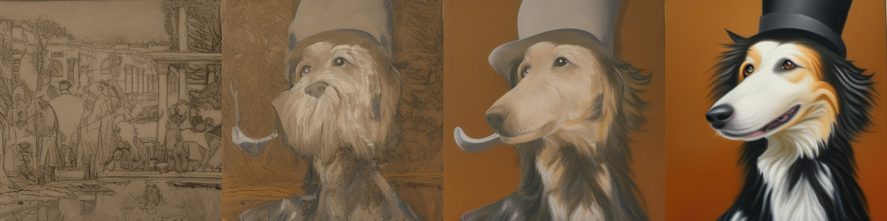

# Vue d'ensemble

<CourseFloatingBanner
    unit={3}
    classNames="absolute z-10 right-0 top-0"
/>

Dans cette unité, vous allez découvrir un puissant modèle de diffusion appelé Stable Diffusion (SD) et explorer ce qu'il peut faire.

## Vue d'ensemble de cette unité :rocket:

Les différentes étapes à suivre pour cette unité :

- Lisez le matériel ci-dessous pour avoir une vue d'ensemble des idées clés de cette unité
- Consultez le [*notebook* **Introduction à Stable Diffusion**_] pour voir l'application pratique de SD dans des cas d'utilisation courants.
- (Facultatif) Consultez la vidéo [_**Stable Diffusion Deep Dive**_](https://www.youtube.com/watch?app=desktop&v=0_BBRNYInx8) (en anglais) et le [_**notebook**_](https://github.com/fastai/diffusion-nbs/blob/master/Stable%20Diffusion%20Deep%20Dive.ipynb) qui l'accompagne pour une exploration plus approfondie des différents composants et de la façon dont ils peuvent être adaptés à différents effets. Ce matériel a été créé pour le cours de FastAI, [*Stable Diffusion from the Foundations*](https://www.fast.ai/posts/part2-2022.html) (en anglais), ce qui en fait un excellent complément à ce cours pour tous ceux qui sont curieux de construire ce type de modèles à partir de zéro. 

## Introduction

 
_Exemples d'images générées à l'aide de Stable Diffusion_

Stable Diffusion est un puissant modèle de diffusion latent conditionné par le texte. Ne vous inquiétez pas, nous expliquerons ces mots dans quelques instants ! Sa capacité à créer des images étonnantes à partir de descriptions textuelles en a fait une sensation sur Internet. Dans cette unité, nous allons explorer le fonctionnement du modèle de diffusion latent et voir quels sont ses autres atouts.
 
## Diffusion latente

Plus la taille des images augmente, plus la puissance de calcul nécessaire pour travailler avec ces images s'accroît. Ceci est particulièrement prononcé dans une opération appelée auto-attention, où le nombre d'opérations croît de façon quadratique avec le nombre d'entrées. Une image carrée de 128 pixels a 4 fois plus de pixels qu'une image carrée de 64 pixels, et nécessite donc 16 fois (c'est-à-dire 4²) la mémoire et le calcul dans une couche d'auto-attention. Ce problème se pose pour tous ceux qui souhaitent générer des images en haute résolution !

 
_Diagramme provenant du papier [*High-Resolution Image Synthesis with Latent Diffusion Models*](http://arxiv.org/abs/2112.10752)_

La diffusion latente permet d'atténuer ce problème en utilisant un modèle distinct appelé auto-encodeur variationnel (VAE pour *Variational Auto-Encoder*) pour **compresser** les images dans une dimension spatiale plus petite. Le raisonnement sous-jacent est que les images ont tendance à contenir une grande quantité d'informations redondantes. Avec suffisamment de données d'entraînement, un VAE peut espérer apprendre à produire une représentation beaucoup plus petite d'une image d'entrée et ensuite reconstruire l'image sur la base de cette petite représentation **latente** avec un haut degré de fidélité. Le VAE utilisé dans SD prend des images à 3 canaux et produit une représentation latente à 4 canaux avec un facteur de réduction de 8 pour chaque dimension spatiale. En d'autres termes, une image d'entrée carrée de 512 pixels sera compressée en une représentation latente de 4x64x64.

En appliquant le processus de diffusion à ces **représentations latentes** plutôt qu'à des images en pleine résolution, nous pouvons bénéficier de nombreux avantages liés à l'utilisation d'images plus petites (moins d'utilisation de mémoire, moins de couches nécessaires dans le UNet, des temps de génération plus rapides...) tout en décodant le résultat en une image en haute résolution une fois que nous sommes prêts à voir le résultat final. Cette solution permet de réduire considérablement le coût de l'entraînement et d'exécution de ces modèles. 

## Conditionnement

Dans l'unité 2, nous avons montré comment l'apport d'informations supplémentaires au UNet nous permet d'exercer un contrôle supplémentaire sur les types d'images générées. C'est ce que nous appelons le conditionnement. Étant donné une version bruitée d'une image, le modèle est chargé de prédire la version débruitée **en fonction d'indices supplémentaires** tels qu'une étiquette de classe ou, dans le cas de Stable Diffusion, une description textuelle de l'image. Au moment de l'inférence, nous pouvons introduire la description d'une image que nous aimerions voir et un peu de bruit pur comme point de départ, et le modèle fait de son mieux pour " débruiter " l'entrée aléatoire en quelque chose qui corresponde à la légende. 

 
_Diagramme montrant le processus d'encodage de texte qui transforme le prompt d'entrée en un ensemble d'enchâssements de texte (les `encoder_hidden_states`) qui peuvent ensuite être introduits dans l'UNet en tant que condition._

Pour que cela fonctionne, nous devons créer une représentation numérique du texte qui capture des informations pertinentes sur ce qu'il décrit. Pour ce faire, SD s'appuie sur un *transformer* pré-entraîné basé sur ce que l'on appelle CLIP. L'encodeur textuel de CLIP a été conçu pour traiter les légendes d'images sous une forme pouvant être utilisée pour comparer les images et le texte, il est donc bien adapté à la tâche de création de représentations utiles à partir de descriptions d'images. Un prompt est d'abord *tokenizer* (sur la base d'un large vocabulaire où chaque mot ou sous-mot se voit attribuer un *token* spécifique), puis transmis à l'encodeur textuel de CLIP, qui produit un vecteur à 768 dimensions (dans le cas de SD 1.X) ou à 1024 dimensions (SD 2.X) pour chaque *tokens*. Pour que les choses restent cohérentes, les prompts sont toujours rembourrés/tronqués pour avoir une longueur de 77 *tokens*, de sorte que la représentation finale que nous utilisons comme conditionnement est un tenseur de forme 77x1024 par prompt.

Alors, comment introduire ces informations de conditionnement dans l'UNet pour qu'il les utilise dans ses prédictions ? La réponse est ce que l'on appelle l'attention croisée. Des couches d'attention croisée sont disséminées dans l'UNet. Chaque emplacement spatial de l'UNet peut "s'intéresser" à différents *tokens* dans le conditionnement du texte, en apportant des informations pertinentes provenant du prompt. Le diagramme ci-dessus montre comment ce conditionnement textuel (ainsi que le conditionnement basé sur le temps) est fourni à différents endroits. Comme vous pouvez le constater, à chaque niveau, l'UNet a de nombreuses possibilités d'utiliser ce conditionnement !

## Guidage sans classification

Il s'avère que même avec tous les efforts déployés pour rendre le texte de conditionnement aussi utile que possible, le modèle a toujours tendance à s'appuyer principalement sur l'image d'entrée bruyante plutôt que sur le prompt lorsqu'il fait ses prédictions. D'une certaine manière, de nombreuses légendes ne sont que vaguement liées aux images qui leur sont associées et le modèle apprend donc à ne pas trop s'appuyer sur les descriptions ! Toutefois, cela n'est pas souhaitable lorsqu'il s'agit de générer de nouvelles images : si le modèle ne suit pas le prompt, nous risquons d'obtenir des images qui ne sont pas du tout liées à notre description.

 
_Images générées à partir du prompt "Une peinture à l'huile d'un colley avec un chapeau haut de forme" avec l'échelle CFG 0, 1, 2 et 10 (de gauche à droite)_

Pour résoudre ce problème, nous utilisons une astuce appelée "Classifier-Free Guidance" (CGF). Pendant l'entraînement, le conditionnement du texte est parfois laissé en blanc, ce qui oblige le modèle à apprendre à débruiter les images sans aucune information textuelle (génération inconditionnelle). Ensuite, au moment de l'inférence, nous faisons deux prédictions distinctes : l'une avec le texte prompt comme conditionnement et l'autre sans. Nous pouvons ensuite utiliser la différence entre ces deux prédictions pour créer une prédiction combinée finale qui pousse **encore plus loin** dans la direction indiquée par la prédiction conditionnée par le texte selon un certain facteur d'échelle (l'échelle de guidage), avec l'espoir d'obtenir une image qui corresponde mieux au prompt. L'image ci-dessus montre les résultats d'un prompt à différentes échelles de guidage. Comme vous pouvez le voir, des valeurs plus élevées donnent des images qui correspondent mieux à la description.

## Autres types de conditionnement : super-résolution, peinture et profondeur d'image

Il est possible de créer des versions de Stable Diffusion qui prennent en compte d'autres types de conditionnement. Par exemple, le modèle [Depth-to-Image model](https://huggingface.co/stabilityai/stable-diffusion-2-depth) possède des canaux d'entrée supplémentaires qui recueillent des informations approfondies sur l'image en cours de débruitage et, au moment de l'inférence, nous pouvons introduire la carte de profondeur d'une image cible (estimée à l'aide d'un modèle distinct) pour espérer générer une image dont la structure globale est similaire. 

 
_SD conditionné par la profondeur est capable de générer des images différentes avec la même structure globale (exemple provenant de StabilityAI)_

De la même manière, nous pouvons introduire une image basse résolution comme conditionnement et demander au modèle de générer la version haute résolution ([comme utilisé par le Stable Diffusion Upscaler](https://huggingface.co/stabilityai/stable-diffusion-x4-upscaler)). Enfin, nous pouvons introduire un masque montrant une région de l'image à régénérer dans le cadre de la tâche de complétion d'image (*inpainting*), où les régions non masquées doivent rester intactes tandis que le nouveau contenu est généré pour la zone masquée. 

## Finetuning avec DreamBooth

_Image provenant de la [page du projet dreambooth] (https://dreambooth.github.io/) basée sur le modèle Imagen_

DreamBooth est une technique permettant de *finetuner* un modèle texte-image afin de lui "apprendre" un nouveau concept, tel qu'un objet ou un style spécifique. La technique a été développée à l'origine pour le modèle Imagen de Google, mais a été rapidement adaptée pour [fonctionner pour Stable Diffusion](https://huggingface.co/docs/diffusers/training/dreambooth). Les résultats peuvent être extrêmement impressionnants (si vous avez vu quelqu'un avec une photo de profil IA sur les médias sociaux récemment, il y a de fortes chances qu'elle provienne d'un service basé sur Dreambooth), mais la technique est aussi sensible aux paramètres utilisés, alors consultez notre *notebook* et [cet article de blog sur les différents paramètres d'entraînement](https://huggingface.co/blog/dreambooth) pour obtenir des conseils sur la façon de la faire fonctionner le mieux possible.

## Notebooks

| Chapitre                                    | Colab                                                                                                                                                                                               | Kaggle                                                                                                                                                                                                   | Gradient                                                                                                                                                                               | Studio Lab                                                                                                                                                                                                   |
|:--------------------------------------------|:----------------------------------------------------------------------------------------------------------------------------------------------------------------------------------------------------|:---------------------------------------------------------------------------------------------------------------------------------------------------------------------------------------------------------|:---------------------------------------------------------------------------------------------------------------------------------------------------------------------------------------|:-------------------------------------------------------------------------------------------------------------------------------------------------------------------------------------------------------------|
| Introduction à Stable Diffusion             |               |               |               |               |
| Plongée dans Stable Diffusion               |               |               |               |               |

Le *notebook Stable Diffusion Introduction* est une courte introduction à Stable Diffusion avec la bibliothèque 🤗 *Diffusers*, présentant quelques exemples d'utilisation de base en utilisant des pipelines pour générer et modifier des images.

Enfin, le *notebook* et la vidéo *Stable Diffusion Deep Dive* décomposent chaque étape d'un pipeline de génération typique, en suggérant de nouvelles façons de modifier chaque étape pour un contrôle créatif supplémentaire. 

## Project

LIEN VERS L'EVENT

## Ressources complémentaires
Une liste non exhaustive de ressources (en anglais) à consulter :
- [High-Resolution Image Synthesis with Latent Diffusion Models](http://arxiv.org/abs/2112.10752), le papier qui a introduit l'approche derrière Stable Diffusion
- [CLIP](https://openai.com/blog/clip/) apprend à relier le texte aux images et l'encodeur textuel est utilisé pour transformer un prompt textuel en la riche représentation numérique utilisée par SD. Voir également [cet article sur OpenCLIP] (https://wandb.ai/johnowhitaker/openclip-benchmarking/reports/Exploring-OpenCLIP--VmlldzoyOTIzNzIz) pour en savoir plus sur les récentes variantes de CLIP open-source (dont l'une est utilisée pour la version 2 de SD).
- [GLIDE: Towards Photorealistic Image Generation and Editing with Text-Guided Diffusion Models](https://arxiv.org/abs/2112.10741) un papier précoce démontrant le conditionnement de texte et le CFG

Vous avez identifié d'autres ressources intéressantes ? Faites-le nous savoir et nous les ajouterons à cette liste.